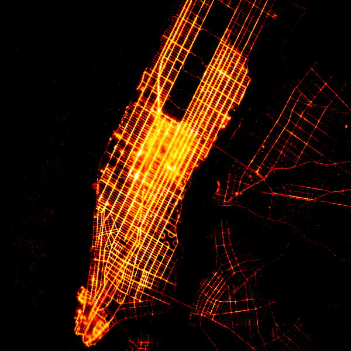
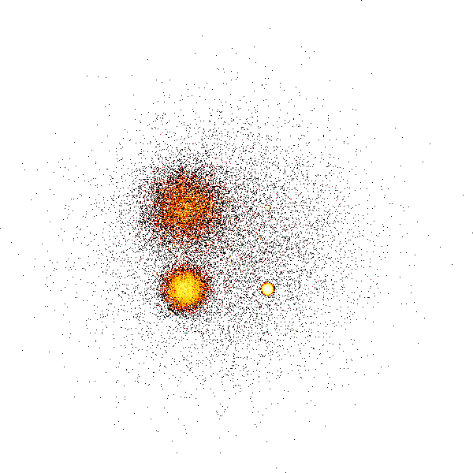
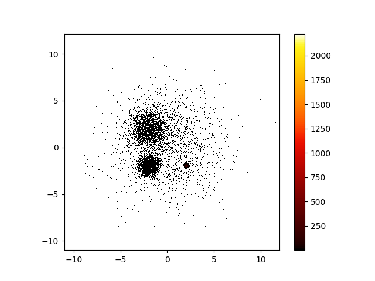

# datashader-cli


[](https://pypi.python.org/pypi/datashader-cli)
[](https://anaconda.org/conda-forge/datashader-cli)

[](https://pyup.io/repos/github/wybert/datashader-cli)


**Quick visualization of large datasets using CLI based on [datashader](https://github.com/holoviz/datashader).**

## Installation

### Use pip

````bash
pip install datashader-cli
````

### Use pip from Github

```bash
pip install git+https://github.com/wybert/datashader-cli.git
```

## Quick Start

Visualize 10 million NYC taxi trip data points in Gigabytes.


<!-- tips -->

> Tips:  You can download the NYC taxi trip data from [here](https://www1.nyc.gov/site/tlc/about/tlc-trip-record-data.page) or use the command `datashader examples` to download the datashader examples. The nyc_taxi.csv file will be located in `datashader-examples/data/nyc_taxi.csv`.
You can also find some data in this repository, download these use `wget https://raw.githubusercontent.com/wybert/datashader-cli/main/tests/data.csv` and `wget https://raw.githubusercontent.com/wybert/datashader-cli/main/tests/data.geo.parquet`, etc.

Create a shaded scatter plot of points and save it to png file, set background color to black. 

```bash
datashader_cli points nyc_taxi.parquet --x pickup_x --y pickup_y pickup-scatter.png --background black

```



Visualize the geospaital data, support Geoparquet, Shapefile, Geojson, Geopackage, etc.


```bash
datashader_cli points data.geo.parquet data.png --geo true
```




Use matplotlib to render the image, matplotlib will enable the colorbar, but it can't use spread function


```bash
datashader_cli points data.geo.parquet data.png --geo true --matplotlib true
```



## Usage

```bash
datashader_cli --help

# sage: datashader_cli [OPTIONS] COMMAND [ARGS]...

#   Quick visualization of large datasets using CLI based on datashader.

#   Supported data format: csv, parquet, hdf, feather, geoparquet, shapefile,
#   geojson, geopackage, etc.

# Options:
#   --help  Show this message and exit.

# Commands:
#   points  Visualize points data.
```

Quick visualization of large point datasets using CLI based on datashader.

```bash
datashader_cli points --help

# Usage: datashader_cli points [OPTIONS] DATA_PATH OUTPUT_APTH

#   Visualize points data.

# Options:
#   --x TEXT              Name of the x column, if geo=True, x is optional
#   --y TEXT              Name of the y column, if geo=True, y is optional
#   --w INTEGER           How many pixels wide to make the image
#   --h INTEGER           How many pixels high to make the image
#   --x_range TEXT        Range of the x axis, in the form of "xmin,xmax"
#   --y_range TEXT        Range of the y axis, in the form of "ymin,ymax"
#   --agg TEXT            Aggregation function, e.g. "mean", "count", "sum", see
#                         datashader docs
#                         (https://datashader.org/api.html#reductions) for more
#                         options
#   --agg_col TEXT        Column to aggregate on, e.g. "value"
#   --by TEXT             Column to group by, e.g. "category", see datashader
#                         docs (https://datashader.org/api.html#reductions) for
#                         more options
#   --spread_px INTEGER   How many pixels to spread points by, e.g. 1, see https
#                         ://datashader.org/api.html#datashader.transfer_functio
#                         ns.spread
#   --how TEXT            How to map values to colors, valid strings are
#                         ‘eq_hist’ [default], ‘cbrt’ (cube root), ‘log’
#                         (logarithmic), and ‘linear’. see https://datashader.or
#                         g/api.html#datashader.transfer_functions.set_backgroun
#                         d
#   --cmap TEXT           Name of the colormap, see https://colorcet.holoviz.org
#                         for more options
#   --geo BOOLEAN         Whether the data is geospatial, if True, x and y are
#                         optional, need Geopandas installed to use this option,
#                         supported data format: Geoparquet, shapefile, geojson,
#                         geopackage, etc.
#   --background TEXT     Background color, e.g. "black", "white", "#000000",
#                         "#ffffff"
#   --matplotlib BOOLEAN  Whether to use matplotlib to render the image, if
#                         True, need matplotlib installed to use this option.
#                         Matplotlib will enable the colorbar, but it can't use
#                         spread function
#   --help                Show this message and exit.
```


## Credits

-   Free software: MIT license
-   Documentation: https://wybert.github.io/datashader-cli
    

## Features

- point data visualization
